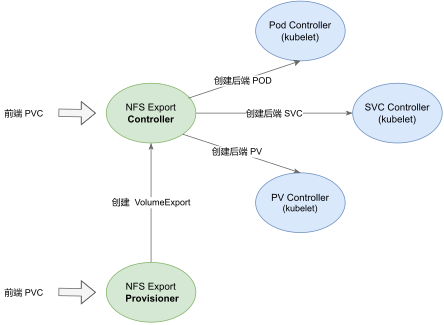
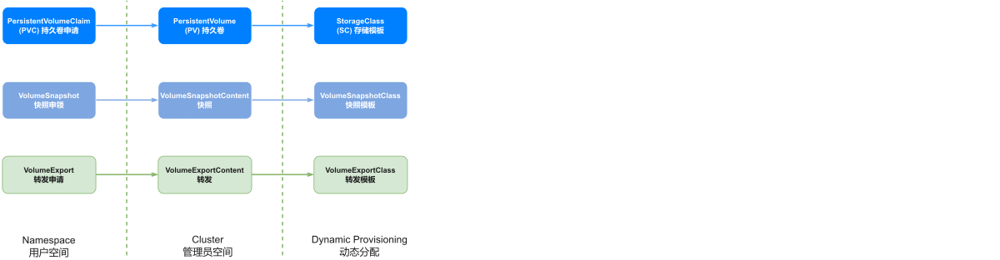
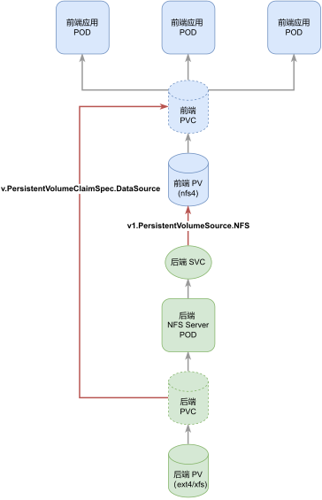

# External NFS Exporter

Dynamically provisioned NFS exports for Kubernetes block volumes

## Overview

This project aims to provide **"per-volume"** `NFS export` for `PersistentVolume`

NFS failover is handled by a Kubernetes Pod.

## Diagrams

### Control Plane



### Control Space


### Data Plane



## How to Build

```console
$ make all
```

This will build docker images for `provisioner` & `exporter`, and push them to daocloud.io registry.

## How to deploy

```
$ make install
```

This will deploy `provisioner` and CRDs.

Result:

```Console

$ kubectl get po -n volume-nfs-export
NAME                                     READY   STATUS    RESTARTS   AGE
volume-nfs-provisoner-66877b686d-g29nm   1/1     Running   0          64m

$ kubectl api-resources --api-group nfsexport.rafflescity.io
NAME                   SHORTNAMES   APIVERSION                          NAMESPACED   KIND
volumeexportcontents                nfsexport.rafflescity.io/v1alpha1   false        VolumeExportContent
volumeexports                       nfsexport.rafflescity.io/v1alpha1   true         VolumeExport
```

## How to test

```console
$ make try
```

This will create NFS Export for a volume using the default `StorageClass`, and then run an Nginx pod using that export.

Frontend Result:

```console

$ kubectl -n default get po,pvc,volumeexportcontent

NAME                                          READY   STATUS    RESTARTS   AGE
pod/nginx-95d65dd-bzjrn                       1/1     Running   0          3m52s
pod/nginx-95d65dd-qh9p4                       1/1     Running   0          3m53s
pod/nginx-95d65dd-wrw4q                       1/1     Running   0          3m52s

NAME                                   STATUS   VOLUME                                     CAPACITY   ACCESS MODES   STORAGECLASS    AGE
persistentvolumeclaim/volume-nfs-pvc   Bound    pvc-d95a92af-e4d4-4a60-9522-3506e21dd321   15Gi       RWX            volume-nfs-sc   3m54s

NAME                                                                                    DATA VOLUME                                AGE
volumeexportcontent.nfsexport.rafflescity.io/pvc-d95a92af-e4d4-4a60-9522-3506e21dd321   pvc-37778281-25c3-425a-823f-b1a044f60205   2m11s
```

Backend Result:

```Console
$ kubectl -n volume-nfs-export get po,pvc,svc,volumeexport
NAME                                                   READY   STATUS    RESTARTS   AGE
pod/pvc-d95a92af-e4d4-4a60-9522-3506e21dd321-backend   1/1     Running   0          6m51s
pod/volume-nfs-provisoner-66877b686d-4jb7w             1/1     Running   0          8m51s

NAME                                                                     STATUS   VOLUME                                     CAPACITY   ACCESS MODES   STORAGECLASS   AGE
persistentvolumeclaim/pvc-d95a92af-e4d4-4a60-9522-3506e21dd321-backend   Bound    pvc-37778281-25c3-425a-823f-b1a044f60205   15Gi       RWO            local-path     6m53s

NAME                                                       TYPE        CLUSTER-IP      EXTERNAL-IP   PORT(S)                    AGE
service/pvc-d95a92af-e4d4-4a60-9522-3506e21dd321-backend   ClusterIP   10.152.183.83   <none>        2049/TCP,111/TCP,111/UDP   6m53s
```